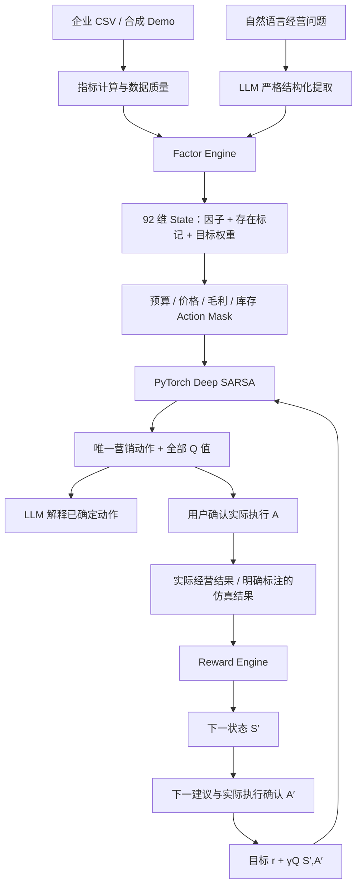

# 三只松鼠 · 深谋远虑营销工作台

**基于 LLM 与 Deep SARSA 的智能营销决策平台**。一个可以运行、上传数据、选择经营目标、记录实际动作、计算奖励并更新模型的竞赛研究原型。

## 当前交付状态

已实现 FastAPI、PyTorch Deep SARSA、40 个核心因子、18 个可控动作、7 类经营目标、6 类偏差风险规则和 SQLite 持久化。操作集中到一个深色工作区：左侧选择经营场景和历史，中间生成建议、确认执行并提交结果，右侧按需打开数据库、企业资料与模型明细。

企业证据表包含三只松鼠 2025 年年报、2026 年半年报和 AI 评价管理公开案例，共 10 条来源记录。问题检索结果保存到决策记录并提供给解释层。另提供 60 天 × 5 渠道合成运营数据、预训练 checkpoint、实际训练曲线与对照结果。

已通过 50 项 Python 测试、前端 TypeScript 检查和生产构建。改版后的浏览器闭环与手机布局检查见 [本地验收记录](docs/verification.md)，现场操作见 [展示流程](docs/demo-guide.md)。

**公开企业资料有真实来源，日级 CSV 是合成示例，不是三只松鼠内部数据。** 无 API 密钥时，页面显示“未接入 LLM / 模板解释”。两个 LLM 实验组显示未运行。后端支持 OpenAI、DeepSeek 与 OpenRouter 免费模型；配置密钥不等于已验证实际调用。GitHub 与 Render 连接已核实，源码仓库为 `15-dot-py/llm-sarsa`。云端发布与外网验收结果见部署记录。

## 云端网站部署

Render Python 原生运行环境使用 `bash scripts/render-build.sh` 构建前端及 Python 依赖，使用 `python -m scripts.serve` 启动一个完整的同源服务。健康检查路径为 `/api/health`，网站分享地址自动读取 Render 的 `RENDER_EXTERNAL_URL`，无需在代码里写死域名。云端服务与当前电脑的运行状态无关。

`render.free.yaml` 为免费云端演示配置，后台实际运行 PyTorch Deep SARSA。免费实例 15 分钟无访问后休眠，重启、重新部署和休眠会丢失本地 SQLite 记录、上传数据与在线模型更新；该配置适合邀请试用，不能作为持久数据保存方案。`render.yaml` 为收费实例与持久磁盘配置，启用前须确认费用。限制依据：[Render 免费服务文档](https://render.com/docs/free)。

## 直接运行（当前电脑）

双击项目根目录的 **启动系统.cmd**，或在 PowerShell 中：

```powershell
powershell -NoProfile -ExecutionPolicy Bypass -File .\start.ps1
```

浏览器打开 **http://127.0.0.1:8000/**。页面由 FastAPI 同源提供，不需要分别启动前后端。服务已运行时，脚本直接打开已有服务。当前电脑已安装独立 `.venv` 并构建前端；无需重新安装。

服务停止后，启动脚本会重新启动它。关闭启动终端将停止前台服务。本地地址只能在当前电脑访问，不能作为评委手机扫码的公网网址。

## 手机访问

双击 **手机共享启动.cmd**，或运行 `powershell -NoProfile -ExecutionPolicy Bypass -File .\start.ps1 -Lan`。需要先关闭原有的本机启动窗口。脚本读取当前网卡地址，监听 `0.0.0.0`，网页的“手机访问”显示实际局域网网址和二维码。手机与电脑须连接同一个 Wi-Fi，服务须保持运行。

若同一 Wi-Fi 仍无法访问，检查 Windows 是否允许 Python 接收入站连接；当前电脑网络属于公共网络。可在管理员 PowerShell 运行下面这条局域网范围的规则，规则只允许本地子网连接 TCP 8000：

```powershell
New-NetFirewallRule -DisplayName 'Shenmou LAN TCP 8000' -Direction Inbound -Action Allow -Protocol TCP -LocalPort 8000 -RemoteAddress LocalSubnet -Profile Any
```

电脑 IP 可能随网络变化，使用网页当前显示的地址。局域网不能通过移动网络访问；任意网络扫码需要实际 Render 公网服务。Render 发布后会读取官方 `RENDER_EXTERNAL_URL` 自动生成二维码，也可用 `PUBLIC_BASE_URL` 指定自定义域名，依据见 [Render 环境变量文档](https://render.com/docs/environment-variables)。

## 系统解决的问题

营销问题通常同时涉及获客成本、平台变化、库存、毛利和客户留存。单一指标改善不等于整体收益提高；一次建议也不等于持续经营决策。本平台把当前经营信息转为可追踪状态，给出约束内的营销动作，并用执行后的结果更新动作价值。

LLM 本身不能替代这条学习链路。它适合处理自然语言和解释业务信息，却不能仅凭一段描述证明某一营销动作具有长期增量收益。Deep SARSA 使用神经网络近似动作价值函数，处理连续多因子状态，并用实际下一动作完成序贯更新。选择 SARSA 不意味着它在所有营销问题上优于其他算法；当前版本用实验检验这一假设。

## 架构与职责



- **LLM**：提取定性业务信号及原文证据；解释已经确定的动作。OpenAI 使用 Responses API 与 Structured Outputs，DeepSeek 使用 JSON Output 与本地严格结构校验，OpenRouter 免费接口使用 Chat Completions、JSON Schema 与本地严格结构校验。提取结构不含动作字段，解释动作与模型动作不一致时拒绝解释并使用模板。密钥只在后端配置。
- **Factor Engine**：登记定义、量纲、范围、来源、缺失情况和可控性；构建状态。文本不会覆盖实测库存、CAC 等经营指标；未观测外部变量可以接收明确标注的语义映射。
- **Deep SARSA**：读取状态、计算 18 个 Q 值、执行约束屏蔽并选择合法动作。建议使用贪心策略，仿真训练使用 epsilon-greedy。
- **Reward Engine**：把不同量纲指标标准化，再按经营目标计算正负贡献。权重进入状态末尾，目标变化有明确上下文。
- **Bias Engine**：从历史操作、渠道指标、预测与实际差异、决策依据记录计算信号，不由 LLM 凭感觉诊断心理。
- **Database**：会话、上传数据、决策、奖励、转移、模型与优化器状态保存。模型参数与转移在同一 SQLite 事务中提交。

只有实际 API 解释成功时 `explanation_source = "LLM"`。模板解释为 `"Template"`，规则提取为 `"Rule parser"`。所有模型建议的 `decision_source = "Deep SARSA"`；人工执行覆盖另存为 `execution_source = "Human override"`。

## 一个工作区内的入口

| 入口 | 可操作内容 |
|---|---|
| 主区 | 最新 ROI、CAC、库存、贡献利润；经营问题、目标与约束；建议、实际动作确认与反馈 |
| 运营数据库侧栏 | Demo / CSV 上传、质量与口径、原始行、日指标、因子和状态向量 |
| 企业资料侧栏 | 三只松鼠财务、渠道与 AI 应用披露；报告期、数值、来源及页码 |
| 模型侧栏 | 本次 Q 值与屏蔽原因、Reward、更新凭证；训练、对照实验与 13 个组件 |
| 最近记录 / 全部记录 | 决策状态、实际动作、来源与模型版本；完整 JSON 导出 |
| 手机访问侧栏 | 当前访问模式、实际地址与二维码；无可共享地址时不生成本机二维码 |

原有路径兼容同一个工作区，通过侧栏打开对应内容。没有另设七个导航页面。算法研究与本次改版依据见 [改版说明](docs/workspace-redesign.md)：已有 HOBA 等研究融合 LLM 与 SARSA，本项目定位为企业场景中的系统改进，不宣称首次融合。

## 完成一轮真实闭环

1. 数据中心选 Demo，或上传 CSV；先确认指标口径和缺失项。
2. 决策中心输入问题，选择目标及预算、毛利约束，生成建议。
3. 读取 Q 值、模型依据与解释；确认实际执行动作。可以人工调整为其他合法动作，必须记录理由。
4. 执行后填写实际收入、利润、ROI、CAC、库存和转化率。可补充销量、广告费、促销费、回流占比与退货率。
5. 系统计算 Reward，保存下一状态并生成下一建议。**此时尚未完成非终止 SARSA 更新。**
6. 确认下一步实际执行动作 A′ 后，用该确切动作进行更新。页面与历史显示真实 TD Target、Loss、梯度范数、更新次数和版本。
7. 若经营周期已结束，可在反馈时勾选终止；也可在下一建议尚未执行时选择结束周期。终止目标只用 r，绝不虚构 A′。

“有效 / 一般 / 无效”是主观反馈，只保存，不直接冒充数值 Reward。仿真按钮会实际运行环境，但这类结果永久标记为 simulation。

## 因子、State 与选择

核心 40 因子包括绩效、惩罚、业务、渠道、外部与偏差信号。每项包含 `name, category, enabled, normalization_method, min_value, max_value, weight, lag, controllable, description, source`。候选包括 CLV、竞品价格、退款率、缺货风险等，缺少数据时不假装已经接入。

当前采用固定业务范围 min-max 截断，避免在预测时使用未来指标拟合范围。State 为 **40 个标准化值 + 40 个存在标记 + 12 个目标权重 = 92 维**。范围与字段定义形成 signature，加载不同因子定义的 checkpoint 会失败。改变核心维度或范围必须重训。

因子选择包括：下一日收入增长的 Spearman 相关、按时间划分训练与测试的随机森林置换重要性、神经 Q 对 ±0.1 输入变化的敏感度、固定策略的因子组输入消融。预测分析最多使用最近 180 个观测日，限制大文件的计算时间；各历史状态的偏差信号只使用当时及以前的记录。数值由程序计算，可能为零或负；不根据相关性直接删掉高 CAC 等风险变量。

这几种分析各自回答不同问题：预测关联不等于策略价值，输入敏感度不等于因果收益，未重训消融也不等于重新训练后的最终影响。后续应加入真实业务对照和重训消融。

## Action 与约束

18 个动作覆盖抖音、小红书、搜索、淘宝新客、私域留存预算，优惠补贴、折扣、价格，低 ROI 渠道削减、库存消化和保持策略。动作只改变企业可控变量。节假日、竞品、平台流量属于状态，不属于动作。

当前与下一状态均执行 mask：预算上限、毛利与价格底线、停用渠道、折扣范围、清仓库存阈值、禁止新增促销。被屏蔽动作仍展示 Q 值及原因。约束过严导致无合法动作时返回具体错误，不自动绕过限制。

## Reward 与经营目标

```text
z_i = clip((metric_i - lower_i) / (upper_i - lower_i), 0, 1)
w_i = configured_weight_i / sum(configured_weights)
R = sum(w_i * z_i * sign_i)
```

正项：营销贡献利润率、ROI、转化率、回流占比代理、库存周转、收入增长、新客占比。负项：CAC、退货率、额外促销成本率、库存压力、收入波动。当前 Reward 是经营偏好函数，**不是利润会计公式**，利润、ROI 与成本项有一定信息重叠；权重与逐项贡献透明展示。

7 个 Profile：利润优先、销售增长、库存消化、客户留存、新客拓展、获客效率、均衡经营。可以在网页调整全部 12 项权重。缺失项贡献为零，同时显示可用权重覆盖；覆盖不同的记录不宜直接比较。在线学习会将缺失标记一并传给模型。

## 偏差风险识别

| 风险信号 | 计算依据与数据要求 |
|---|---|
| 沉没成本 | 整体或渠道连续负 ROI，随后仍增加广告预算的观察比例 |
| 损失厌恶 | 负营销贡献利润后预算继续维持或增加的观察比例 |
| 过度自信 | 至少 3 条预测收入与实际收入，计算正向相对预测误差均值 |
| 近期偏差 | 至少 7 条完整预算 / 收入记录，预算反向调整频率与收入波动组合 |
| 从众 | 明确记录“跟随竞品”，且缺少支持实验的比例 |
| 锚定 | 明确记录历史参照，并声明与当前证据冲突的比例 |

每条评分带历史日期、渠道或预测证据。执行确认的可选区域可记录收入预测、竞品跟随依据、历史参照与证据冲突。**没有记录就显示证据不足；这些规则只识别操作风险，不证明心理因果。**

## Deep SARSA 与训练

当前 PyTorch 基础模型采用 `92 → 96 → 96` 特征层，状态价值头与 18 动作优势头组成 Dueling Q 网络；目标权重在网络内乘 8，使其尺度与标准化因子相近。仍使用实际下一动作的 SARSA 目标：

```text
target = reward + gamma * Q(next_state, actual_next_action)
terminal_target = reward
loss = SmoothL1Loss(Q(state, actual_action), target)
```

使用 Adam 或 SGD、梯度裁剪、可配置 gamma、学习率、epsilon、衰减、最小探索率、轮数、随机种子、周期长度；checkpoint 包含网络、优化器、探索率、随机生成器状态和因子 signature。**没有用 max Q，没有伪装成 Q-learning；Tabular SARSA 独立保留为基线。**

历史 CSV 用于状态与初始经营结构、成本、价格、库存、渠道预算的仿真校准，不包含完整反事实转移。它不足以单独识别价格弹性与渠道因果反应，当前环境的 CPM、转化弹性、需求噪声等仍是明确的合成假设。

环境包含预算递减回报、广告滞后、曝光→点击→订单、客户留存、竞品压力、节日窗口、季节、平台流量、库存与补货。使用独立随机种子产生可复现轨迹，策略不同会改变利润与库存路径。

```powershell
.\.venv\Scripts\python.exe -m scripts.pretrain --episodes 180
```

该命令训练结构化输入 Deep SARSA、观察指标 Deep SARSA 和 Tabular SARSA，各 180 轮；在 10000–10007 独立测试种子上评估。保存 `data/pretrained.pt`、`training_report.json` 和 `experiments.json`。更新文件后重启服务，新会话读取新基础模型；已有会话保留原模型。

实验组包含规则策略、Tabular SARSA、Deep SARSA、结构化外部信号输入消融、LLM-only 和 LLM + Deep SARSA。**语义预置组不是 LLM 实测组**。配置有效 API 并明确接受调用成本后，运行 `--include-llm` 才尝试后两组；超时、额度或解析失败会记为失败，不替换成伪造结果。该实验涉及多次 API 调用，默认每日 120 次上限可能不足，可按实际预算调整。

目前实验未证明语义辅助模型的稳定优势，训练前后也可能下降。曲线不做美化。Q 表示折扣累计 Reward；下一期预期 Reward 使用 24 个合成环境情景的均值及 10%–90% 分位区间，**不是企业利润预测、统计置信区间或效果保证**。

## CSV 格式与指标

必填列：

```csv
date,sales,revenue,advertising_cost,impressions,clicks,orders,new_customers,returning_customers,channel,price,discount,promotion_cost,inventory,returns
```

可选：`cogs, unit_cost, return_loss, list_price, forecast_revenue`。Demo 含明确的合成商品成本与退货损失。

- 同一 `date + channel` 一行。渠道为抖音、小红书、淘宝、搜索广告、私域。
- `sales` 为销量件数，`orders` 为订单数，不能把两者混淆。新客与回流客户人数合计不可超过订单。
- `price` 为折后成交价格；`revenue` 为折后销售收入；`discount` 为 0–0.5 小数；`promotion_cost` 只含额外补贴成本。不可把降价损失再重复填到促销成本里。
- `inventory` 是期末渠道独立分仓库存，不能重复填写共享总库存。
- 支持 UTF-8 / BOM / GB18030，10–9000 行，2 MB 上限；日期、重复行、非有限值、负数、不合理漏斗与比例会校验。
- 缺少商品成本时按收入 58% 估算，缺少退货损失时按退货件数 × 成交价 × 70% 估算，并显示估算说明。

| 指标 | 当前口径 |
|---|---|
| CTR | clicks / impressions |
| 转化率 | orders / clicks |
| 广告 CAC | advertising_cost / new_customers，不包含完整归因与所有获客成本 |
| ROAS | revenue / advertising_cost |
| 营销贡献利润 | revenue − cogs − advertising_cost − promotion_cost − return_loss |
| 营销 ROI | 营销贡献利润 / (advertising_cost + promotion_cost) |
| AOV | revenue / orders |
| 回流客户占比 | returning_customers / (new_customers + returning_customers)，并非真实跨期复购率 |
| 库存周转代理 | 日销量 / (期末库存 + 日销量)，未计完整补货会计口径 |
| 库存压力 | clip(期末库存 / 日销量 / 60, 0, 1) |

无法观测的分母为零时，转化、回流等比率保持未知，而非编造为实测零。没有完整管理费、税费等数据，不能称净利润。

## OpenRouter 免费 API 配置

先在 [OpenRouter 官方密钥页面](https://openrouter.ai/settings/keys) 登录本人账号并创建密钥。免费接口也需要账号密钥；GitHub / Render 连接本身不提供模型推理权限。

```dotenv
LLM_PROVIDER=openrouter
OPENROUTER_API_KEY=在本机或 Render 环境变量填写
OPENROUTER_MODEL=openrouter/free
LLM_TIMEOUT=45
LLM_ENABLED=true
LLM_DAILY_CALL_LIMIT=50
```

`openrouter/free` 只路由到免费模型，并根据 JSON Schema 等请求能力筛选模型。本项目同时将输入、输出及单次请求价格上限设为零；免费模型不可用时会明确回退到规则和模板，不改用付费模型。只有实际模型响应通过结构和动作一致性校验，记录才标注 `LLM`，并保存服务返回的具体模型名称。

[官方免费方案](https://openrouter.ai/pricing)目前为每天 50 次 API 请求；系统每天按 UTC 计数，OpenRouter 配置下上限不超过 50。一次完整决策通常调用两次（提取和解释），因此不等于每天 50 次完整决策。免费模型的速率、可用性和延迟会变化，详见[免费路由说明](https://openrouter.ai/docs/guides/routing/routers/free-router)。账号认证和真实公网调用通过之前，页面保留“待配置密钥”或“待实际调用验证”，不把接口契约测试写成上线成功。

## OpenAI API 配置

在项目根目录 `.env` 设置 `OPENAI_API_KEY`、`OPENAI_MODEL`。默认可配置模型为 `gpt-4.1-mini`；具体账号可用性需实际验证。**密钥不能放进前端，也不要上传到 GitHub。** 更改 `.env` 后重启后端。

```dotenv
OPENAI_API_KEY=在本机填写
OPENAI_MODEL=gpt-4.1-mini
OPENAI_TIMEOUT=20
LLM_DAILY_CALL_LIMIT=120
```

调用使用 OpenAI 官方 Structured Outputs 接口，Pydantic 校验；拒绝越界语义信号、空解析结果和动作不匹配解释，超时按明确 fallback 处理。[官方接口说明](https://developers.openai.com/api/docs/guides/structured-outputs)。实际使用情况以当前页面及每条记录的调用来源为准，配置密钥不代表已通过真实调用验证。

## 安装与开发

Python 3.12，Node.js 22+ / 24，pnpm 11。当前版本有 Python 精确依赖锁与 pnpm 锁。

```powershell
# Windows 首次安装
powershell -NoProfile -ExecutionPolicy Bypass -File .\setup.ps1

# Python 核心与 API 测试
.\.venv\Scripts\python.exe -m pytest

# 前端检查 / 构建
cd frontend
pnpm typecheck
pnpm build
```

Linux / macOS：

```bash
python3.12 -m venv .venv
. .venv/bin/activate
pip install --extra-index-url https://download.pytorch.org/whl/cpu -r requirements.lock.txt
cp .env.example .env
cd frontend && pnpm install --frozen-lockfile && pnpm build && cd ..
python -m uvicorn backend.main:app --host 127.0.0.1 --port 8000
```

生产模式只需 Python 服务。开发前端时可把静态构建输出交由后端提供；当前没有另设 Next 开发代理。

## 部署与扫码

项目按用户选择配置 **Render 单个 Docker Web Service + GitHub 源码**。镜像内构建前端，FastAPI 提供网页和接口。

1. 创建 GitHub 仓库并推送本项目（默认排除 `.env`、`.venv`、上传数据、SQLite、个人会话与工具缓存）。项目使用 MIT License；真实企业数据不可作为开源 Demo 上传。
2. Render 从仓库 `render.yaml` 创建 Blueprint，或手动选择 Docker Web Service。
3. 有密钥时配置 `OPENAI_API_KEY`；没有密钥仍可运行规则解析和 SARSA。二维码自动采用 Render 提供的公网地址，只有使用自定义域名时才需设置 `PUBLIC_BASE_URL`。Blueprint 自动生成管理员令牌，仅训练需令牌。
4. `/app/storage` 挂持久化盘，保存 SQLite 和每个会话模型。Render 持久化盘需要付费服务，配置中 `plan: starter` **会产生托管费用**；用户当前未创建账号，未产生部署或付费操作。
5. 检查 `/api/health`，再用公网浏览器完成一次决策与反馈。用实际网址生成二维码，接口为 `/api/share/qr.png`。

Render 默认文件系统不持久，重启会丢失数据；因此不能把一个未持久化的免费演示说成持续学习系统。[Render 持久化说明](https://render.com/docs/disks)、[Docker 部署说明](https://render.com/docs/docker)。当前环境没有 Docker，已完成配置与源码验证，尚未在本机实际构建镜像或部署 Render。

数据库、模型与公开 Demo 数据分别存放。系统使用浏览器随机会话隔离数据，每次反馈只改变本会话模型。会话 ID 充当访问凭证；本原型没有员工账号、角色审批、企业多租户体系或生产级审计，不宜直接公开上传敏感企业数据。公网训练被管理员令牌保护，API 有限频与上传限制，LLM 有调用次数上限。

## 目录与扩展

```text
backend/           API、契约、闭环协调
sarsa/             神经 SARSA、Tabular 基线、训练
factor_engine/     Registry、标准化、预测重要性与敏感度
reward/            Profile 与贡献计算
environments/      随机营销环境
bias_engine/       六类历史证据规则
decision_models/   18 个动作、Mask、13 个组件注册
llm/               严格结构化理解、解释与实验基线
data/              合成 CSV、处理、基础 checkpoint、实验结果
database/          SQLite 与原子事务
evaluation/        共同种子评估、输入消融
frontend/          Next.js 中文工作台
tests/             算法、CSV、API、闭环、保存、LLM 契约、重现性
docs/              架构、展示流程、验收与边界
scripts/           预训练、服务启动辅助
```

新增营销组件用 `ModelLibrary.register(Component(...))`，按统一输出执行。新增核心因子需注册 Factor、更新 State 签名并重训；新增动作需更新网络输出维度、约束与训练。数据库访问集中在 Store，可以后续迁移 PostgreSQL；本版尚未实现 PostgreSQL 驱动，不能称已经支持。

## 后续研究需要补足

真实平台接口、客户级标识、细粒度广告归因、促销成本、补货提前期、竞品证据；仿真参数识别、更多训练种子与重训消融、线下回放和小预算对照实验；API 实测与部署验收。本版本证明闭环可运行、可追踪，尚未证明给三只松鼠带来真实增量利润。比赛命题平台尚未提供接口文档，当前未声称已经连接数智商业实训平台。


## 固定动作问题的修复

输入无关内容时不创建决策；经营目标可根据问题识别，也可手动指定。文本中的预算上限、停用渠道与禁止新增促销进入约束。库存、订单等实测指标继续以数据库为准。新增淘宝、搜索广告的预算份额，以及小红书、淘宝、搜索广告、私域的 ROI/CAC，状态扩展为 92 维。

预训练先用共同随机数生成合法动作的单期终止 SARSA 目标，冷启动 Dueling 网络，再进行多期 on-policy SARSA 更新。训练环境随机化库存、成本、渠道效率和外部信号缺失情况。输入相同状态时仍允许得到同一动作。

2026年10月5日对照检查见 [决策问题核查记录](docs/decision-diagnostics.md)。修复说明不等于企业实证效果；独立仿真平均回报未显示稳定优势。
