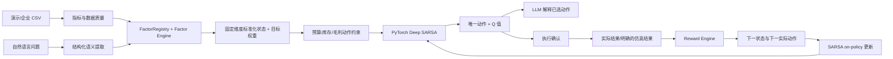

# 可执行架构与技术边界

## 产品与交付

三只松鼠·深谋远虑营销工作台。Next.js / React / TypeScript 构建静态网页，由 FastAPI 同源提供；PyTorch 在 CPU 上进行序贯决策。界面集中在一个工作区，通过侧栏打开企业证据、运营数据与模型明细。Render Docker 单服务配置，SQLite 和模型 checkpoint 使用持久化目录。GitHub 管理源代码，不承担推理服务器职责。

企业公开证据独立保存在 `company_evidence` 表，包含报告期、来源、页码和数值。字符 TF-IDF 检索根据经营问题返回相关条目，写入决策记录并传给语义与解释层。公开汇总财务数据不会覆盖当前运营指标或被拆分成日级训练样本。部署网址由 `PUBLIC_BASE_URL` 或 Render 官方 `RENDER_EXTERNAL_URL` 提供；本机回环网址不生成手机二维码。

## 需要纠正的概念

- 历史营销 CSV 没有反事实转移，不能据此宣称得到最优强化学习策略。CSV 用于经营指标、状态初始化和仿真校准；模型在明确标注的随机仿真环境中预训练。
- Q(s,a) 是折扣累计回报估计，不是下一期利润。下一期奖励展示独立的蒙特卡洛仿真区间；它也不是实际业绩承诺。
- SARSA 必须使用下一步实际动作，不能使用 max Q，也不能在用户未执行下一动作时假称在线更新完成。
- 经营目标和奖励权重变化会改变任务。奖励权重作为上下文加入固定维度状态，checkpoint 保存因子和目标定义。
- 复购率需要客户标识和跨期复购记录；CSV 的 returning_customers 仅支持回流客户占比代理。
- 广告 ROAS = 收入 / 广告费；营销 ROI = (收入 - 商品成本 - 广告费 - 促销成本 - 退货损失) / (广告费 + 促销成本)。缺少成本时采用显式估算，不能称真实净利润。
- 库存按渠道独立分仓填报。共享库存须由导入者分配，不能把一个总库存复制到每个渠道后求和。
- 多项奖励可能重复计量利润与成本。提供权重与各项贡献，并说明这是策略偏好函数，不是利润会计公式。
- 偏差识别是基于可核查历史的风险信号，不是对人员心理的诊断；缺少竞品跟随、预测、历史锚定记录时返回证据不足。
- 消费预算、促销、价格可以控制；节假日、竞品动作、平台规则只能作为状态。动作约束在当前和下一状态都生效。
- 无 API 密钥或调用失败时明确显示规则解析 / 模板解释。不会伪造 LLM-only 实验或保证训练曲线单调提高。

## 模块边界

## 工程选择

backend/ 仅协调 API 与会话；sarsa/ 包含神经网络、Tabular baseline 和训练器；factor_engine/ 注册固定因子、标准化与重要性计算；reward/ 负责多目标奖励；environments/ 负责随机经营转移；bias_engine/ 负责证据规则；decision_models/ 提供可注册组件；llm/ 只做结构化输出与解释；database/ 保存会话、数据、决策、转移与模型参数；evaluation/ 运行共同随机种子实验。

每个浏览器使用隔离会话，模型从只读预训练 checkpoint 初始化。决策草稿不算已执行；用户确认执行后记录 A。提交结果后产生下一决策草稿；下一动作被确认执行时，用这个确切的 A' 更新上一条记录。终止周期可以仅用 r 更新。反馈具有幂等保护。SQLite 将模型参数、优化器状态、转移和决策记录放在同一事务，避免部分保存。

## 分阶段验收

1. 核心：因子标准化、奖励、随机环境、动作屏蔽、Tabular SARSA、Deep SARSA 和 checkpoint 的真实测试。
2. 数据：生成 60 天 × 5 渠道的可复现合成 CSV；校验导入、指标定义、缺失值和趋势。
3. API：决策 → 确认执行 → 反馈 → 下一动作确认 → 更新；检查会话隔离、重复提交、模型保存恢复。
4. 网页：仪表盘、决策中心、实验室、模型库、数据中心、历史与反馈，中文和移动端布局检查。
5. 实验：规则、Tabular、Deep、语义辅助 Deep 与可用时的 LLM-only；记录种子、参数、样本数、均值与波动。
6. 交付：中文 README、CSV 模板、测试证据、Docker / Render 配置、源码版本和公网健康检查。缺少外部账号认证时明确列出待接通项，不伪造网址。
